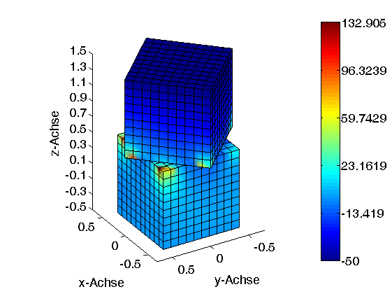

# fixthejet

Information is *not* knowledge. 

Information can be transformed into knowledge by consuming it in a way to understand patterns. One of the primary ways to consume large quantities of information is through pictures: charts, plots, maps that convey the message. Before, 2015, many such figures were inadvertantly prepared using a color scheme called _jet_ that is visually stimulating due to the abundance of colors. Unfortunately, we have come to know of the harm it causes only recently. The _jet_ is not [perceptually uniform](https://programmingdesignsystems.com/color/perceptually-uniform-color-spaces/) which is a fancy way of saying what you see is not what you get. The colormap is known to create artificial gradients in perceptibility which can mislead interpretations of figures. For more information check out the [presentation](https://www.youtube.com/watch?v=xAoljeRJ3lU) of launch of the new default colormaps in _matpltolib_. 

This script allows you to change an image (.jpg/.png) file made with _jet_ colormap to any other colormap of your choice. The script selectively changes _jet_ colors only. All others colors in the image remain unchanged (including background and text). 

## Running

`python fixthejet.py --input <input file> --output <output file>`

Use `--colormap <output colormap>` to control colormap of outfile. Default is _viridis_. Only Matplotlib colormaps supported. 

### Prerequisites

Python 3

## Example 1

`python fixthejet.py --input .\images\SST.png --output .\images\SST_viridis.png`

### Input file
 

### Output file

## Example 2

`python fixthejet.py --input .\images\cube.png --output .\images\cube_plasma.png --colormap plasma` 

### Input file

### Output file

## Example 3

`python fixthejet.py --input .\images\cone.jpg --output .\images\cone_inferno.jpg --colormap inferno` 

### Input file

### Output file

## License
* Do not own Copyright. This is built on top of [Carreau's](https://github.com/Carreau) work.

## Acknowledgments

* Forked from [viridisify](https://github.com/Carreau/miscs/blob/master/Viridisify.ipynb)
